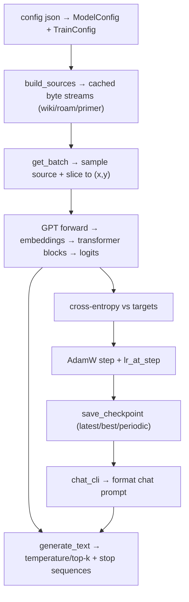

### niels-gpt

tiny llm-from-scratch project + a small chat primer.

### prerequisites
- python >= 3.11
- uv (recommended) or pip
- internet for first run: pulls `wikitext-103-raw-v1` via `datasets` into `~/.cache/huggingface`
- torch wheels default to cpu; macs use mps automatically; cuda only if you pass `--device` to train (chat_cli auto-picks mps->cpu)

### install (from a fresh clone)
**with uv (recommended):**
```bash
uv venv
source .venv/bin/activate
uv pip install -e ".[dev]"
pytest -q
```

**with pip:**
```bash
python3 -m venv .venv
source .venv/bin/activate
pip install -e ".[dev]"
pytest -q
```

### data you need
- wiki: required. fetched on first train via `datasets.load_dataset("wikitext", "wikitext-103-raw-v1")`.
- primer: `data/primer.txt` is included; optional extra `data/primer.generated.txt` (see below).
- roam (optional): drop markdown notes under `data/.roam-data/`; they are split deterministically; skipped if missing.
- caches: stream binaries are written to `data/cache/streams/`. delete to rebuild; note that wiki always re-reads via `datasets`, so stay online or warm the HF cache.

### configs + checkpoints
- `configs/smoke.json`: 1k steps sanity run.
- `configs/train.json`: 20k steps.
- config schema: `{"model": {...}, "train": {...}}` overriding dataclasses in `niels_gpt.config`.
- checkpoints land in `checkpoints/` (`latest.pt`, `best.pt`, periodic). the repo already has a few you can reuse.

### train
```bash
python -m niels_gpt.train --config configs/smoke.json \
  [--device cpu|mps|cuda] \
  [--resume /path/to/ckpt.pt]
```
notes:
- only wiki is required; roam/primer are used if present.
- seed in the config drives deterministic splits and sampling.
- first run needs internet for wikitext; huggingface cache is respected afterward.
- checkpoints are saved automatically (latest, best, periodic).

### chat / inference
```bash
python -m niels_gpt.chat_cli --ckpt checkpoints/latest.pt \
  [--max-new-tokens 256 --temperature 0.9 --top-k 50 --seed 42] \
  [--system "..." | --system-file path]
```
uses mps if available, otherwise cpu. stop sequences prevent tag leakage; default system prompt talks about niels in third person.

### generate primer dialogues (optional)
```bash
python tools/generate_primer.py --seed 0 --n-per-category 30 --shuffle
```
writes `data/primer.generated.txt` using `data/public_facts.json` + `tools/primer_combinators.py`.

### tests
```bash
pytest -q
```

### command reference
- smoke train (quick sanity): `python -m niels_gpt.train --config configs/smoke.json`
- full train: `python -m niels_gpt.train --config configs/train.json`
- resume: `python -m niels_gpt.train --config configs/train.json --resume checkpoints/latest.pt`
- pick device explicitly: add `--device cpu|mps|cuda`
- chat: `python -m niels_gpt.chat_cli --ckpt checkpoints/latest.pt --max-new-tokens 256 --temperature 0.9 --top-k 50 --seed 42`
- generate primer: `python tools/generate_primer.py --seed 0 --n-per-category 30 --shuffle`
- tests: `pytest -q`

## walkthrough for newcomers
goal: show the whole loop end-to-end with plain language. tokens here are just utf-8 bytes (0-255), not fancy subwords.

### data flow (mermaid)


### configs (all in `niels_gpt.config`)
- `ModelConfig`: `V` vocab=256 bytes; `T` context window; `C` embedding width; `L` layers; `H` heads; `d_ff` MLP width; `dropout`; `rope_theta` rotary period.
- `TrainConfig`: `seed`; `B` batch size; `total_steps`; `eval_every`; `eval_steps`; `log_every`; `ckpt_every`; `base_lr`; `warmup_steps`; `min_lr`; `grad_clip`; `p_train` source mix.
- `load_config_from_json(path)`: reads `{"model": {...}, "train": {...}}`, validates keys, fills defaults (including default `p_train`).

### data sources and caching (`niels_gpt.streams`)
- `StreamBuildConfig`: paths for wiki/roam/primer, cache dir, validation fractions, delimiter for primer dialogues, seed, toggles for required/optional sources.
- `build_sources(cfg) -> (train_bytes, val_bytes)`: loads wiki via Hugging Face datasets (train/val splits), optional roam markdown, primer dialogues; splits primer/roam deterministically; writes cached `.bin` and `.meta.json` under `data/cache/streams`; reuses cache if metadata matches; enforces required sources unless `allow_missing_sources=True` (train.py sets only wiki required).

### batching (`niels_gpt.batching`)
- `get_batch(sources, p, B, T, device, generator) -> (x, y)`: samples which source each item comes from using probabilities `p`, slices a random window of length `T+1` bytes, returns `x` (inputs) and `y` (next-token targets) on the target device. Validates lengths and probability sums.

### tokenizer + chat formatting
- `tokenizer.encode(text) -> 1D tensor`: utf-8 bytes -> ids; `decode(ids) -> str` reverses.
- `chat_format.format_chat(messages)`: turn-structured string ending with `assistant: ` prompt.
- `chat_format.extract_assistant_reply(generated_text)`: pulls the last assistant reply, stripping trailing tags.

### model architecture (`niels_gpt.model`)
- `GPT(cfg)`: byte-level decoder-only transformer. Stack: token embedding -> dropout -> `L` Blocks -> layer norm -> tied LM head.
- `Block`: pre-norm residual block: attention then MLP with dropout.
- `CausalSelfAttention`: multi-head attention with rotary position embeddings (RoPE), causal mask, dropout.
- `MLP`: two linear layers with GELU.
- weights init: normal(0,0.02) for linear/embedding; layernorm weight=1, bias=0.

### training loop (`niels_gpt.train`)
1) parse args `--config`, optional `--resume`, `--device`.  
2) `ensure_dirs()` makes `checkpoints/` and `configs/`.  
3) load configs; select device (`mps` if available else cpu, unless you passed `--device`).  
4) seed torch.  
5) `build_sources` with wiki required; renormalize `p_train` to available sources.  
6) init model + AdamW (weight decay 0.1, betas 0.9/0.95). If resuming, load state and validate shape-critical config.  
7) for each step: set lr via `lr_at_step` (warmup + cosine); `get_batch`; forward; `cross_entropy` loss; zero_grad/backward; `clip_grad_norm`; `optimizer.step`.  
8) log every `log_every`; eval every `eval_every` on wiki val via `eval.eval_loss_on_stream`; save `best.pt` when val improves.  
9) checkpoint every `ckpt_every` to `step_xxx.pt` and `latest.pt`; final save at end.

### evaluation (`niels_gpt.eval`)
- `eval_loss_on_stream(model, stream, B, T, device, eval_steps, seed)`: deterministic batches from a single stream, averages cross-entropy in eval mode.

### generation (`niels_gpt.generate`)
- `generate_ids(model, prompt_ids, max_new_tokens, T, temperature, top_k, stop_sequences, device, generator)`: autoregressive sampling with optional top-k; stop sequences truncate output early; uses CPU generator for deterministic sampling across devices.
- `generate_text(model, prompt_text, cfg, ...)`: convenience wrapper around encode/generate_ids/decode.

### chat CLI (`niels_gpt.chat_cli`)
- loads checkpoint, rebuilds model, seeds CPU generator, builds chat prompt with system/user turns, calls `generate_text` with stop sequences to avoid emitting role tags, extracts assistant reply, loops.

### learning rate (`niels_gpt.lr_schedule.lr_at_step`)
- linear warmup to `base_lr`, then cosine decay to `min_lr` over the remaining steps.

### checkpoints (`niels_gpt.checkpoint`)
- `save_checkpoint(path, model_cfg, train_cfg, model, optimizer, step, best_val_loss)` writes torch dict.
- `load_checkpoint(path, device)` maps to device.
- `validate_model_config_match` ensures resumed shapes match (V, T, C, L, H, d_ff, dropout, rope_theta).

### devices (`niels_gpt.device.get_device`)
- returns `mps` if available on mac, else `cpu`. train CLI accepts `--device` to force (including cuda if you have it).

### primer generation (`tools/generate_primer.py`)
- builds synthetic dialogues from templates + `data/public_facts.json`; writes `data/primer.generated.txt`. Dialogues use the same `system/user/assistant` line format with `<dialogue>` delimiter.

## production-ish extras
### repo layout
- `niels_gpt/`: core library (config, device, tokenizer, streams, batching, model, train/eval/generate/chat).
- `configs/`: runnable configs (`smoke.json`, `train.json`).
- `data/`: primer, optional roam notes under `.roam-data/`, cached streams under `cache/streams/`.
- `checkpoints/`: saved models (`latest.pt`, `best.pt`, periodic).
- `tools/`: primer generation helpers.
- `tests/`: pytest suite covering masking, batching, tokenizer, blocks, etc.

### expectations and limits
- toy, byte-level model (V=256, T=256, L=4, H=4 by default); not production-grade quality/safety.
- device auto-detect only covers mps/cpu; pass `--device cuda` yourself if you have a GPU.
- internet needed on first run for wikitext download; respects HF cache afterward.
- training uses simple logging to stdout; no wandb/metrics piping.

### reproducibility and checkpoints
- seeds are in config; training and eval use torch.Generator for deterministic sampling.
- cache for streams includes metadata; delete `data/cache/streams` to rebuild after data changes.
- resume with `--resume checkpoints/latest.pt`; shape-critical config is validated on resume.

### hardware/perf notes
- default model is small enough for CPU/MPS; for CUDA pass `--device cuda`.
- batch size `B` and context `T` in config drive memory; lower them if you OOM.

### troubleshooting
- wikitext download fails offline: pre-download via HF CLI or run once online; or set `allow_missing_sources=True`/`required_sources=()` in config to skip (quality drops).
- primer missing: ensure `data/primer.txt` exists or adjust `enabled_sources`/`required_sources`.
- roam missing: create `data/.roam-data/` or remove from `enabled_sources`.
- stream too short errors: your data must be at least `T+1` bytes per source; lower `T` or add data.
- mps quirks: if you hit generator/device errors, rerun with `--device cpu`.
