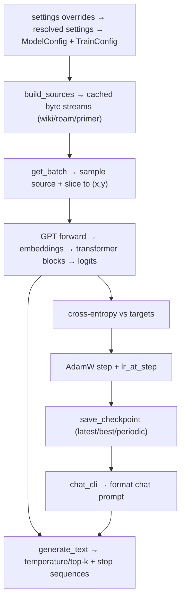

### niels-gpt

tiny llm-from-scratch project + a small chat primer.

### prerequisites
- python >= 3.11
- uv (recommended) or pip
- internet for first run: pulls `wikitext-103-raw-v1` via `datasets` into `~/.cache/huggingface`
- device auto-detection: cuda (NVIDIA GPU) > mps (Apple Silicon) > cpu. No manual `--device` needed.

### install (from a fresh clone)
**with uv (recommended):**
```bash
uv venv
source .venv/bin/activate
uv pip install -e ".[dev]"
python tools/download_checkpoint.py   # download pretrained model
pytest -q
```

**with pip:**
```bash
python3 -m venv .venv
source .venv/bin/activate
pip install -e ".[dev]"
python tools/download_checkpoint.py   # download pretrained model
pytest -q
```

### data you need
- wiki: required. fetched on first train via `datasets.load_dataset("wikitext", "wikitext-103-raw-v1")`.
- primer (pretrain): `data/primer.txt` is included; optional extra `data/primer.generated.txt` (see below).
- primer (SFT): `data/primer.jsonl` with chat messages in JSONL format (see PR-03 spec).
- roam (optional): drop markdown notes under `data/.roam-data/`; they are split deterministically; skipped if missing.
- caches:
  - pretrain binaries written to `data/cache/streams/`. delete to rebuild.
  - SFT binaries written to `data/cache/sft/{dolly15k,oasst1,primer}/`. delete to rebuild.
  - note: wiki always re-reads via `datasets`, so stay online or warm the HF cache.

### configs + checkpoints
- `configs/smoke.json`: 1k steps sanity run.
- `configs/train.json`: 20k steps.
- config schema: `{"model": {...}, "train": {...}}` overriding dataclasses in `niels_gpt.config`.
- checkpoints land in `checkpoints/` (`latest.pt`, `best.pt`, periodic).
- pretrained checkpoint hosted on [Hugging Face](https://huggingface.co/nnandal/niels-gpt); run `python tools/download_checkpoint.py` to fetch.

### benchmark: pick overnight config without guessing

**what it does:** finds the best model config + training knobs for an 8-hour run on your hardware without random OOMs or fake speed numbers.

**quick start:**
```bash
# run the sweep (auto-detects cuda > mps > cpu, uses device-aware grid)
python tools/bench_sweep.py --device auto

# view results
cat bench/summary.md
```

**device-aware grids:** the benchmark automatically selects an appropriate search grid based on your hardware:
- **CUDA <10GB** (RTX 2080, 3070, etc.): conservative grid, T=[256,512], AMP enabled
- **CUDA 10-16GB** (RTX 3080, 4070, etc.): medium grid, T=[256,512], 2 model sizes
- **CUDA 16GB+** (RTX 3090, 4090, A100, etc.): full grid, T=[512,1024], 3 model sizes
- **MPS** (Apple Silicon): full grid with unified memory, AMP disabled (stability)
- **CPU**: minimal grid for smoke testing only

**what you get:**
- `bench/results.jsonl`: all measured trials as JSON lines (machine-readable, for plotting later)
- `bench/summary.md`: human summary ranked by overnight throughput

The top row tells you:
- which (T, C, L, H) to use
- max microbatch size that fits
- whether amp/checkpointing help or hurt
- estimated tokens in 8 hours

**how to use the winner:**
1. take the top config from `summary.md`
2. set your training config to match (T, C, L, H, micro_B, amp, activation_checkpointing)
3. pick `accum_steps` to hit your target effective batch: `effective_batch = micro_B * accum_steps`
4. compute overnight steps: `steps_8h ≈ (tokens/sec * 8 * 3600) / (micro_B * accum_steps * T)`
5. run pretrain→sft with that config

**what it measures (per config):**
- can it run at all? (B=1 success)
- how big a microbatch fits? (binary search for max_B)
- how fast is it? (tokens/sec at best batch size)
- does amp really run in fp16? (dtype summary)
- does checkpointing change the fit envelope? (max_B increases when checkpointing on)

**safety features:**
- each trial runs in a fresh subprocess with timeout (default 20s)
- OOM detection: catches allocation errors and moves on
- device sync: timing uses `torch.cuda.synchronize()` or `torch.mps.synchronize()` to avoid async lies
- synthetic workload: no dataset/IO/tokenization noise, just model+training loop

**customizing the grid:**
```bash
# smaller timeout for quick sweep
python tools/bench_sweep.py --device auto --timeout_s 15 --max_micro_B 64

# custom grid (JSON file with list of configs)
python tools/bench_sweep.py --device auto --grid my_grid.json
```

**smoke tests:**
```bash
pytest -q tests/test_bench_trial_smoke.py tests/test_bench_sweep_smoke.py
```

**what not to do:**
- don't trust max_B as "best speed" — often max_B//2 is faster
- don't shrink model too far for speed — you'll get a fast dumb model
- don't ignore the 90% threshold — configs within 90% of best throughput but with more params are often better

**rebuild caches**
```bash
# Build all pretrain and SFT caches (dolly, oasst1, primer; PR-04)
# Requires data/primer.jsonl to exist; validates default caches at end
python -m niels_gpt.cache.cli build-all \
  --cache-dir data/cache \
  --seed 42 \
  --fineweb-train-tokens 200000000 \
  --fineweb-val-tokens 5000000 \
  --shard-bytes 134217728 \
  --roam-dir data/.roam-data

# Build primer SFT cache separately (optional; build-all now includes it per PR-04)
python -m niels_gpt.cache.cli build-sft-primer \
  --primer-jsonl data/primer.jsonl \
  --out-dir data/cache/sft \
  --seed 42 \
  --val-frac 0.1 \
  --t-max 1024
```

**full pipeline smoke (pretrain → sft → generation)**
pretrain smoke
```bash
python -m train.run --phase pretrain --config configs/pretrain_smoke.json --no-resume
```

sft smoke
```bash
python -m train.run --phase sft --config configs/smoke.json --no-resume
```

chat (interactive)
```bash
python -m niels_gpt.chat_cli --ckpt checkpoints/latest.pt
```

### train (pr-06 runner + pr-07 amp/checkpointing)
Prereqs:
- caches must exist:
  - pretrain: `data/cache/streams/{wiki,roam,primer}_{train,val}.bin + .meta.json`
  - sft: `data/cache/sft/{dolly,oasst1}_{train,val}.bin + .meta.json` (+ `.idx.npy` per split; missing idx defaults to hard error unless you set `allow_missing_idx=true`)
- configs point to those cache dirs (`cache_dir`, `streams_cache_dir`).
- `--device` accepts `cpu|mps|cuda` (runner auto-detects if omitted: cuda > mps > cpu).
- all defaults now live in `niels_gpt/settings.py`; `--config` is treated as overrides (legacy full configs still work but print a warning). To inspect the resolved config: `python -m train.run --phase pretrain --config configs/pretrain.json --print_config`.
- guardrail: `python tools/audit_config_coverage.py` fails if hyperparameters or special tokens are hardcoded outside settings/config.

Commands:
- Pretrain:
  ```bash
  python -m train.run --phase pretrain --config configs/pretrain.json \
    [--device cpu|mps|cuda] \
    [--resume /path/to/ckpt.pt | --no-resume]
  ```
- SFT (expects sft caches; optional `allow_missing_idx=true` in config to synthesize trivial idx):
  ```bash
  python -m train.run --phase sft --config configs/sft.json \
    [--device cpu|mps|cuda] \
    [--resume /path/to/ckpt.pt | --no-resume]
  ```
- Pipeline (runs pretrain, then sft init from pretrain best):
  ```bash
  python -m train.run --phase pipeline --config configs/pipeline.json \
    [--device cpu|mps|cuda] \
    [--no-resume]  # recommended for fresh pipeline
  ```

**Mixed Precision (AMP) & Activation Checkpointing:**
- AMP defaults to `"auto"` (device-aware):
  - **CUDA**: enabled with fp16 (bf16 on Ampere+ GPUs) for ~2x speedup via Tensor Cores
  - **MPS**: disabled (known stability issues cause loss divergence)
  - **CPU**: disabled (no benefit)
- Override in config JSON if needed:
  ```json
  {
    "training": {
      "pretrain": {
        "amp": true,              // or false, or "auto" (default)
        "amp_dtype": "fp16",      // "fp16" or "bf16"
        "activation_checkpointing": false  // reduce memory via gradient checkpointing
      }
    }
  }
  ```
- Activation checkpointing trades ~20-30% speed for lower memory (useful for large models on limited VRAM)
- Training logs show: `device=cuda, amp=true (fp16), activation_checkpointing=False, micro_B=16, accum_steps=4, effective_batch=64, params=...`

Checkpoint layout:
- Phase-scoped histories:
  - `checkpoints/pretrain/{latest.pt,best.pt,step_XXXXXXX.pt}`
  - `checkpoints/sft/{latest.pt,best.pt,step_XXXXXXX.pt}`
- Root copies for serving/pr-8 compatibility:
  - `checkpoints/latest.pt` (copy of phase latest at save time)
  - `checkpoints/best.pt` (copy of current best; after pipeline this is sft best)
- Best updates only on improved eval; eval cadence from config `eval_every`.

Resume precedence:
1. `--resume PATH` if provided.
2. `--no-resume` → always start fresh.
3. Else auto-resume from phase latest if present; no root fallback for single phases (to avoid wrong-phase resumes).

Config provenance:
- Checkpoints store both resolved config and `_raw` input sections for auditing.

### command reference (clone → caches → train → chat)

Environment:
```bash
python3 -m venv .venv
source .venv/bin/activate
pip install -e ".[dev]"
```

1) Build caches (pretrain + SFT):
```bash
# Build all pretrain and default SFT sources (dolly, oasst1, primer; PR-04)
# Requires data/primer.jsonl; validates default mix caches at end
python -m niels_gpt.cache.cli build-all \
  --cache-dir data/cache \
  --seed 42 \
  --fineweb-train-tokens 200000000 \
  --fineweb-val-tokens 5000000 \
  --shard-bytes 134217728 \
  --roam-dir data/.roam-data

# Build primer SFT cache (optional; build-all now includes it per PR-04)
python -m niels_gpt.cache.cli build-sft-primer \
  --primer-jsonl data/primer.jsonl \
  --out-dir data/cache/sft \
  --seed 42 \
  --val-frac 0.1 \
  --t-max 1024
```
Notes: downloads HF datasets (needs network); writes streams under `cache/streams` and sft under `cache/sft`. `--roam-dir` optional; set to a real directory to include roam notes. As of PR-04, `build-all` includes primer SFT and validates that caches for all default mix sources exist at the end; requires `data/primer.jsonl`.

2) Train tokenizer (if rebuilding):
```bash
python scripts/train_tokenizer.py \
  --input_glob "data/**/*.txt" \
  --input_glob ".roam-data/**/*.md" \
  --out_dir artifacts/tokenizer/v2 \
  --vocab_size 16384 \
  --seed 42 \
  --model_type unigram
```
Writes `spm.model` + `tokenizer_meta.json`.

3) Train:
- use the pretrain / sft / pipeline commands above (settings-style overrides only).

4) Chat / inference:
```bash
python -m niels_gpt.chat_cli --ckpt checkpoints/best.pt \
  --max-new-tokens 256 \
  --temperature 0.9 \
  --top-k 50 \
  --seed 42 \
  [--system "text"] \
  [--system-file path/to/system.txt] \
  [--no-kv-cache]
```
`/exit` to quit. KV-cache generation is enabled by default; add `--no-kv-cache` for debugging with full forward passes.

5) Generate primer dialogues:
```bash
python tools/generate_primer.py \
  --out data/primer.generated.txt \
  --seed 0 \
  --n-per-category 30 \
  --shuffle
```

6) Upload checkpoint to Hugging Face:
```bash
python tools/upload_checkpoint.py --checkpoint checkpoints/best.pt
```
Requires `huggingface-cli login` and `pip install huggingface-hub`.

7) Smoke cache builder (network):
```bash
python -m scripts.smoke_loaders
```

Cache expectations recap:
- Streams: `data/cache/streams/{wiki,roam,primer}_{train,val}.bin + .meta.json`
- SFT: `data/cache/sft/{dolly15k,oasst1,primer}/{train,val}_input_ids.bin + {train,val}_labels.bin + {train,val}_idx.npy + meta.json` (set `allow_missing_idx=true` in sft config only if you intentionally want trivial idx synthesis).
- Default SFT mix (as of PR-03): `{"primer": 0.10, "oasst1": 0.70, "dolly15k": 0.20}`

### chat / inference
```bash
python -m niels_gpt.chat_cli --ckpt checkpoints/latest.pt \
  [--max-new-tokens 256 --temperature 0.9 --top-k 50 --seed 42] \
  [--system "..." | --system-file configs/system_surly.txt] \
  [--no-kv-cache]
```
uses mps if available, otherwise cpu. **KV-cache generation is enabled by default** for faster inference. Generation stops on `<|eot|>` token only (no substring scanning). Default system prompt is loaded from `configs/system_surly.txt` if present.

**flags:**
- `--no-kv-cache`: disable KV-cache and use full forward pass per token (slower, for debugging)

greedy (diagnostic):
`python -m niels_gpt.chat_cli --ckpt checkpoints/best.pt --temperature 0 --top-k 0 --seed 42`

less random:
`python -m niels_gpt.chat_cli --ckpt checkpoints/best.pt --temperature 0.7 --top-k 20 --seed 42`

### generate primer dialogues (optional)
```bash
python tools/generate_primer.py --seed 0 --n-per-category 30 --shuffle
```
writes `data/primer.generated.txt` using `data/public_facts.json` + `tools/primer_combinators.py`.

### primer.jsonl format (PR-03)
Primer SFT dataset uses a JSONL format (one JSON object per line):
```json
{"messages":[{"role":"system","content":"You are a helpful assistant."},{"role":"user","content":"What is 2+2?"},{"role":"assistant","content":"2+2 equals 4."}]}
{"messages":[{"role":"user","content":"Tell me a joke."},{"role":"assistant","content":"Why did the chicken cross the road? To get to the other side!"}]}
```

**Format rules:**
- Each line is a separate training example
- `messages` must be a non-empty list
- Each message must have exactly `role` and `content` keys
- Valid roles: `system`, `user`, `assistant`
- `content` must be a string (may be empty but discouraged)
- File must be UTF-8 encoded
- At least one `assistant` message required per example
- Multiple user/assistant turns are supported

**Rendering:**
- Template: `<|sys|> {content} <|eot|> <|usr|> {content} <|eot|> <|asst|> {content} <|eot|>`
- Loss masking: Only assistant content and assistant `<|eot|>` are trained (everything else is -100)
- Truncation: Examples exceeding `T_max` are truncated from the left (keeping recent turns)
- Examples shorter than 2 tokens after truncation are dropped

### tests
```bash
pytest -q
```

- ### command reference
- smoke pretrain: `python -m train.run --phase pretrain --config configs/pretrain_smoke.json`
- full pretrain: `python -m train.run --phase pretrain --config configs/pretrain.json`
- sft: `python -m train.run --phase sft --config configs/sft.json`
- pipeline: `python -m train.run --phase pipeline --config configs/pipeline.json`
- resume: add `--resume checkpoints/latest.pt` (per-phase)
- pick device explicitly: add `--device cpu|mps|cuda`
- chat: `python -m niels_gpt.chat_cli --ckpt checkpoints/latest.pt --max-new-tokens 256 --temperature 0.9 --top-k 50 --seed 42` (uses KV-cache by default; add `--no-kv-cache` for debugging)
- tokenizer (representative mix): `python scripts/train_tokenizer.py --input_glob "data/.roam-data/**/*.md" --input_glob "data/primer.txt" --include_wikitext --fineweb_bytes 20000000 --out_dir artifacts/tokenizer/v2 --vocab_size 16000 --seed 42`
- tokenizer report: `python tools/tokenizer_report.py --tokenizer artifacts/tokenizer/v2/spm.model --wikitext --fineweb-bytes 20000000`
- fineweb sample to local file: `python tools/sample_fineweb.py --out data/fineweb_sample_20mb.txt --bytes 20000000`
- generate primer: `python tools/generate_primer.py --seed 0 --n-per-category 30 --shuffle`
- download checkpoint: `python tools/download_checkpoint.py`
- upload checkpoint: `python tools/upload_checkpoint.py` (maintainer only)
- tests: `pytest -q`

## walkthrough for newcomers
goal: show the whole loop end-to-end with plain language. tokens here are just utf-8 bytes (0-255), not fancy subwords.

### data flow (mermaid)


### configs and settings
- defaults live in `niels_gpt/settings.py`; overrides are Settings-shaped JSON dicts (see `docs/settings.md`). `mix_pretrain|mix_sft` replace, other dicts deep-merge.
- `resolve_settings(phase, overrides, write_resolved=True)` returns `ModelConfig`, `TrainConfig`, special token ids, stop/banned tokens, and writes `runs/<run_id>/resolved_settings.json` plus checkpoint sidecars.
- `ModelConfig`/`TrainConfig` have no baked-in defaults; they are populated from resolved settings.

### data sources and caching (`niels_gpt.streams`)
- `StreamBuildConfig`: paths for wiki/roam/primer, cache dir, validation fractions, delimiter for primer dialogues, seed, toggles for required/optional sources.
- `build_sources(cfg) -> (train_bytes, val_bytes)`: loads wiki via Hugging Face datasets (train/val splits), optional roam markdown, primer dialogues; splits primer/roam deterministically; writes cached `.bin` and `.meta.json` under `data/cache/streams`; reuses cache if metadata matches; enforces required sources unless `allow_missing_sources=True` (train.py sets only wiki required).

### batching (`niels_gpt.batching`)
- `get_batch(sources, p, B, T, device, generator) -> (x, y)`: samples which source each item comes from using probabilities `p`, slices a random window of length `T+1` bytes, returns `x` (inputs) and `y` (next-token targets) on the target device. Validates lengths and probability sums.

### tokenizer + chat formatting
- `tokenizer.encode(text) -> 1D tensor`: utf-8 bytes -> ids; `decode(ids) -> str` reverses. Tokenizer trained with byte_fallback on roam+primer+wikitext+fineweb sample; caches carry tokenizer sha256 and are rejected on mismatch.
- dataset builders hard-fail if raw text contains any special token strings (`<|ngpt_sys_84a5023f67d74cf29cc4001becde983c|>`, `<|ngpt_usr_84a5023f67d74cf29cc4001becde983c|>`, `<|ngpt_asst_84a5023f67d74cf29cc4001becde983c|>`, `<|ngpt_eot_84a5023f67d74cf29cc4001becde983c|>`).
- `chat_format.format_chat(messages)`: turn-structured string ending with `assistant: ` prompt.
- `chat_format.extract_assistant_reply(generated_text)`: pulls the last assistant reply, stripping trailing tags.

### model architecture (`niels_gpt.model`)
- `GPT(cfg)`: byte-level decoder-only transformer. Stack: token embedding -> dropout -> `L` Blocks -> layer norm -> tied LM head.
- `Block`: pre-norm residual block: attention then MLP (dropout applied inside each submodule, not at block level).
- `CausalSelfAttention`: multi-head attention with rotary position embeddings (RoPE), causal mask, attn_dropout on probs, resid_dropout on output.
- `MLP`: SwiGLU feed-forward with resid_dropout on output.
- weights init: normal(0,0.02) for linear/embedding; layernorm weight=1, bias=0.

### training loop (`train.pretrain` / `train.sft`)
1) parse args `--phase`, `--config`, optional `--resume`, `--device`.  
2) `ensure_dirs()` makes `checkpoints/` and `configs/`.  
3) resolve settings (merge overrides, validate tokenizer specials, write `runs/<run_id>/resolved_settings.json`); select device (`mps` if available else cpu, unless you passed `--device`).  
4) seed torch.  
5) load cached token streams/SFT datasets from `settings.data.caches.*`; build mixtures from `mix_pretrain` or `mix_sft`; pick val source per settings.  
6) init model + AdamW with optimizer hyperparams from settings; resume if requested and validate shape-critical config.  
7) for each step: set lr via `lr_at_step` (warmup + cosine); run `accum_steps` microbatches with `loss/accum_steps` backward; `clip_grad_norm`; `optimizer.step`.  
8) log every `log_every`; eval every `eval_every` on configured val source; save `best.pt` when val improves.  
9) checkpoint every `ckpt_every` to `step_xxx.pt` and `latest.pt` with settings sidecars; final save at end.

### evaluation (`niels_gpt.eval`)
- `eval_loss_on_stream(model, stream, B, T, device, eval_steps, seed)`: deterministic batches from a single stream, averages cross-entropy in eval mode.

### generation (`niels_gpt.generate`)
- `generate_ids(model, prompt_ids, *, max_new_tokens, T, temperature, top_k, top_p, repetition_penalty, eot_id, banned_token_ids, device, generator)`: autoregressive sampling with explicit hyperparams; stops when `eot_id` is produced; uses CPU generator for deterministic sampling across devices.
- `generate_text(model, prompt_text, *, cfg, generation: GenerationSettings, stop_token_id, banned_token_ids, device, generator)`: convenience wrapper around encode/generate_ids/decode driven by resolved generation settings.
- **KV-cache inference** (`niels_gpt.infer.kv_cache`): efficient autoregressive generation using cached key-value pairs to avoid recomputing attention for previous tokens.
  - `generate_ids_cached(model, prompt_ids, *, max_new_tokens, eot_token_id, temperature, top_k, top_p, repetition_penalty, banned_token_ids, generator, trace_layer)`: KV-cache generation with sampling and optional attention tracing. Returns dict with "ids" (including eot if generated) and "steps" (per-token info with optional attention traces). Supports all sampling parameters from uncached generation.
  - `generate_ids_greedy_cached(model, prompt_ids, *, max_new_tokens, eot_token_id)`: greedy (argmax) decoding with KV-cache. Returns list of token IDs including eot if generated.
  - `generate_ids_greedy_full(model, prompt_ids, *, max_new_tokens, eot_token_id)`: baseline greedy decoding without cache (for testing equivalence). No cropping - uses full sequence for exact equivalence. Returns list of token IDs including eot if generated.
  - `prefill(model, prompt_ids, cache, *, trace_layer, return_attn_row)`: process full prompt and fill KV cache in one forward pass.
  - `decode_step(model, last_token_ids, cache, *, trace_layer, return_attn_row)`: process single token and append to cache.
  - KV-cache stores post-RoPE keys and values for all layers; hard cap at T_max enforced with early error; supports attention row tracing for visualization.
  - **EOT behavior**: all generation functions include the eot token in the returned ids list (better for debugging/reproducibility). Client code (like chat CLI) should strip eot when rendering text.

### chat CLI (`niels_gpt.chat_cli`)
- loads checkpoint, rebuilds model, seeds CPU generator, builds chat prompt with system/user turns, calls KV-cache generation by default (falls back to `generate_text` with `--no-kv-cache`), extracts assistant reply, loops. Generation stops on `<|eot|>` token id only (no substring scanning).

### learning rate (`niels_gpt.lr_schedule.lr_at_step`)
- linear warmup to `base_lr`, then cosine decay to `min_lr` over the remaining steps.

### checkpoints (`niels_gpt.checkpoint`)
- `save_checkpoint(path, model_cfg, train_cfg, model, optimizer, step, best_val_loss)` writes torch dict.
- `load_checkpoint(path, device)` maps to device.
- `validate_model_config_match` ensures resumed shapes match (V, T, C, L, H, d_ff, dropout, rope_theta).

### devices (`niels_gpt.device.get_device`)
- auto-detects best available device: `cuda` (NVIDIA GPU) > `mps` (Apple Silicon) > `cpu`
- train CLI accepts `--device` to override (e.g., `--device cpu` to force CPU even when GPU available)

### primer generation (`tools/generate_primer.py`)
- builds synthetic dialogues from templates + `data/public_facts.json`; writes `data/primer.generated.txt`. Dialogues use the same `system/user/assistant` line format with `<dialogue>` delimiter.

## production-ish extras
### repo layout
- `niels_gpt/`: core library (config, device, tokenizer, streams, batching, model, train/eval/generate/chat).
- `configs/`: runnable configs (`smoke.json`, `train.json`).
- `data/`: primer, optional roam notes under `.roam-data/`, cached streams under `cache/streams/`.
- `checkpoints/`: saved models (`latest.pt`, `best.pt`, periodic).
- `tools/`: primer generation helpers.
- `tests/`: pytest suite covering masking, batching, tokenizer, blocks, etc.

### expectations and limits
- small model (V=16000, T=512, C=384, L=8, H=6 by default); still toy-quality; widen/deepen only if you accept more compute.
- device auto-detect covers cuda/mps/cpu; no manual override needed.
- internet needed on first run for wikitext download; respects HF cache afterward.
- training uses simple logging to stdout; no wandb/metrics piping.

### caveats and gaps
- evaluation now reports wiki/roam/primer, but best checkpoint is still keyed on wiki loss; adjust if primer quality matters more.
- `p_train` is renormalized if sources are missing; mixes can drift unless you fail hard on absent data.
- context is 512 tokens and the model is still small; coherence beyond that or for complex tasks will drop quickly.
- gradient accumulation is configured via `accum_steps`; no gradient accumulation scheduling or adaptive scaling is provided.
- sampling/generation uses a CPU `torch.Generator` for determinism across devices; stop sequences are byte-level searches.

### reproducibility and checkpoints
- seeds are in config; training and eval use torch.Generator for deterministic sampling.
- cache for streams includes metadata; delete `data/cache/streams` to rebuild after data changes.
- resume with `--resume checkpoints/latest.pt`; shape-critical config is validated on resume.

### hardware/perf notes
- default model fits on 8GB+ GPUs, Apple Silicon, or CPU (slower).
- CUDA with AMP (auto-enabled) gives best performance via Tensor Cores.
- batch size `B` and context `T` in config drive memory; lower them if you OOM.
- use `python tools/bench_sweep.py` to find optimal config for your hardware.

### troubleshooting
- wikitext download fails offline: pre-download via HF CLI or run once online; or set `allow_missing_sources=True`/`required_sources=()` in config to skip (quality drops).
- primer missing: ensure `data/primer.txt` exists or adjust `enabled_sources`/`required_sources`.
- roam missing: create `data/.roam-data/` or remove from `enabled_sources`.
- stream too short errors: your data must be at least `T+1` bytes per source; lower `T` or add data.
- mps quirks: if you hit generator/device errors, rerun with `--device cpu`.
- **CUDA out of memory**: reduce `micro_B`, enable `activation_checkpointing`, or use smaller `T`. Run `bench_sweep.py` to find safe config.
- **AMP causes NaN losses on MPS**: AMP is auto-disabled on MPS for this reason. If you forced `"amp": true`, set it back to `"auto"` or `false`.
- **Out of memory with activation checkpointing**: reduce batch size `B` or increase `accum_steps` (keeps effective batch same but lower memory per step).
- **Checking GPU detection**: run `python -c "from niels_gpt.device import get_device; print(get_device())"` to verify.
